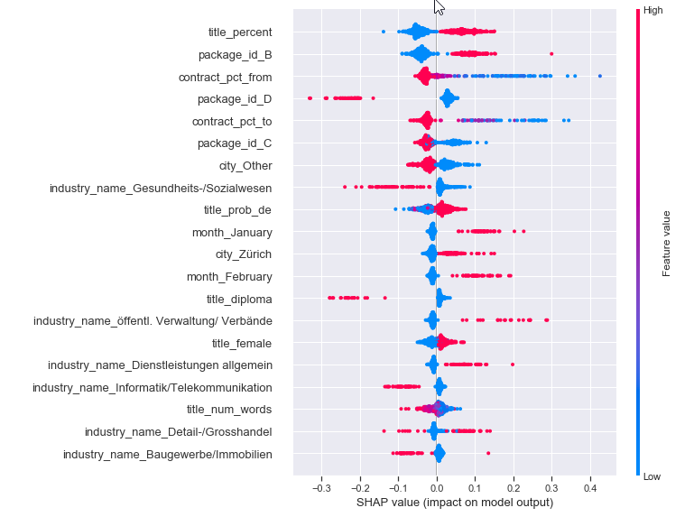
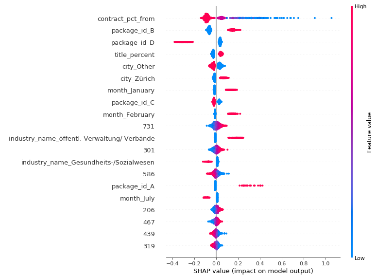
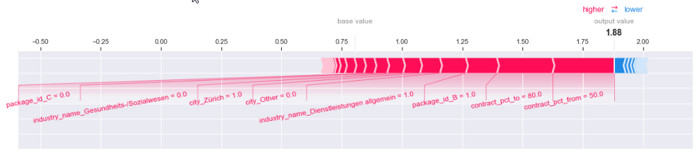
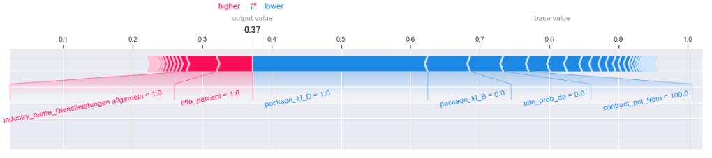
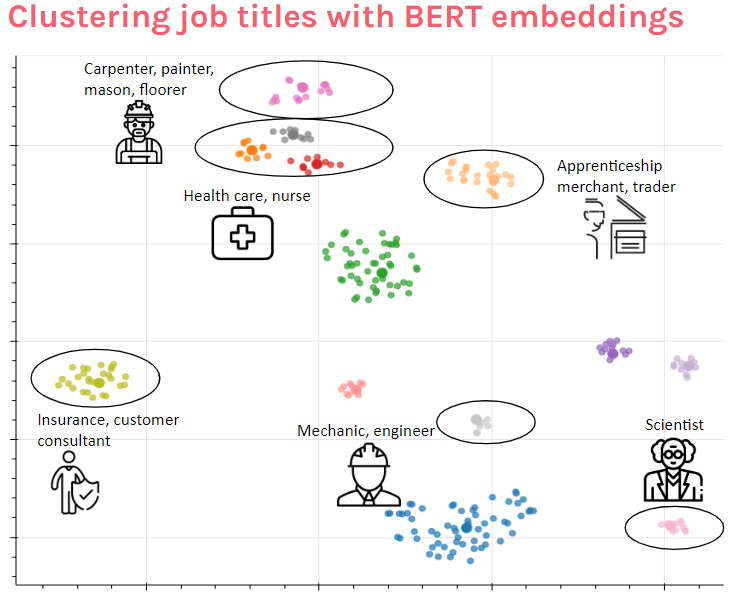
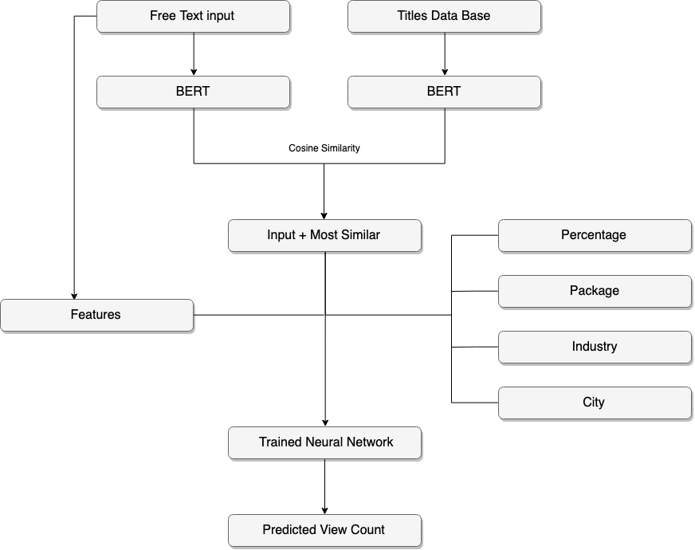

# Optimizing job ad titles at Jobcloud using Google BERT and neural networks

Propulsion Academy Final Project DSWD-2019-03

Authors: [David Furrer](https://github.com/davidfurrer) and [Adrian Imfeld](https://github.com/aimfeld)

## Install

- `git clone` this repo
- Set up the provided Anaconda virtual environment (jobcloud) which includes the needed packages with the right versions: `conda env create -f environment.yml`
- Activate the jobcloud environment: `conda activate jobcloud`
- Run `jupyter lab` and open the provided notebooks.

## Jobcloud's project description

Jobcloud wants to support its customers in creating high-quality job ads. The title of the job ad plays a particularly important role since it serves as the “first impression” after a search on our websites. Therefore, we want to create a tool that assists our customers in creating good job ad titles, either by an auto-completion feature or by some other types of hints or suggestions. We believe that a good job title yields more views, as the user scrolls through the search results page and is more likely to click ads with attractive job titles. Therefore, we provide a data set of job titles and the associated number of views, and challenge you to develop a model that can be used to assist employers to create a good job title. Different approaches could be, but are not limited to (in increasing order of complexity):

1. Develop a predictive model to identify characteristics of a high-quality job title.
2. Develop a predictive model that scores job titles and suggests changes (either real-time
or batch-wise) to the job title text that will improve performance.
3. Develop a model for an on-the-fly autocomplete tool that suggests good job title variants
as the title is being entered.

### Data set description

The data set contains about 100k job ads on www.jobs.ch, randomly sampled from all ads that were on the site between April 1st, 2018, and March 31st, 2019. Each row in the dataset contains the following data for a single job ad (also note the additional remarks below the table):

| Column | Description |
|---|---|
| id | Id of the job ad. |
| start_dt | Start date of the ad. |
| end_dt | End date of the ad. |
| 1d_view_cnt | Number of views on the ad in the first day. |
| 10d_view_cnt | Number of views on the ad in the first 10 days. |
| 30d_view_cnt | Number of views on the ad in the first 30 days. |
| package_id | The name of the feature package for the ad. |
| industry_name | The industry under which the job was listed by the employer. |
| job_location | The location of the job position. |
| job_postal_code | The postal code of the job location. |
| contract_pct_from | The minimum FTE percentage of the job position. |
| contract_pct_to | The maximum FTE percentage of the job position. |
| title | The title of the job ad. |

### Publication period

Ads are by default inserted for a 30-day period. However, shorter or longer publication periods are possible as well.

### Views on the ad

The column [x]d_view_cnt contains the number of views on the ad from the time instant of publication until midnight x days later. If an ad is published at 13:00:00 on Friday, February 1 st, 2019, then 1d_view_cnt tracks the views until 23:59:59 on Saturday, February 2 nd , 2019. Note that, if an ad was online for less than 10 days, then 10d_view_cnt will be equal to 30d_view_cnt. For confidentiality reasons, the absolute number of views has been scaled linearly by the same fixed factor for all x (1, 10, and 30).

### Packages

An employer can book additional feature packages for a job ad to receive more clicks and applications. This particular data set contains four feature packages (ranked A &gt; B &gt; C &gt; D), with package A offering the largest performance boost, package D being the standard base package, and B and C offering two intermediate options. An employer can upgrade (or downgrade) the package of an ad, in which case the ad id will appear twice with different package_id.

### Job location and postal code

Job location is a non-standardized free text field and may contain typos. The postal code may be missing if it wasn’t entered by the employer.

### Contract percentage and FTE

A 100% contract corresponds to one Full Time Equivalent (FTE). Many jobs are offered with a potential range of FTE percentage, e.g. 80-100%, or at a fixed part-time percentage, e.g. 50% or 60%.

## Our approach

This chapter gives a quick overview of our process. For details, see the linked notebooks at the beginning of the chapters.

### Data exploration

- [0_data_exploration_part1.ipynb](0_data_exploration_part1.ipynb)
- [0_data_exploration_part2.ipynb](0_data_exploration_part2.ipynb)

First, we read in the dataset provided by Jobcloud and inspected the data. The summary statistics and histogram plots are provided in the above notebooks.

### Data cleaning

- [1_data_cleaning.ipynb](1_data_cleaning.ipynb) 

We dropped a small amount of rows with missing view count information, ending up with 101735 rows with complete information. Job titles were cleaned by removing html tags (e.g. ` `) and by replacing html special characters with unicode (e.g. `&amp;` => `&`).

### Feature engineering

- [2_feature_engineering.ipynb](2_feature_engineering.ipynb)

In order to predict the job ad view count, we extracted a couple of additional features from the job titles and from the given data:

- `title_clean`: A cleaned version of the given job title (`title`). The cleaned job title was used as input for calculating the BERT embeddings, see below.
- `month`: The month of the publication date of the job ad.
- `weekday`: The weekday of the publication date of the job ad.
- `dayofyear`: Day of year of the publication date of the job ad.
- `days_online`: How many days the ad was online.
- `pct_range`: The contract percent range (e.g. 80%-100%: range = 20). 
- `city`: Extracted from `job_location` and contains 7 major cities, while other cities are binned into an `Other` category.
- `title_num_words`: The number of words in the job title.
- `title_aggressive`: Whether the title contains aggressive characteristics, i.e. UPPERCASE or exclamation marks.
- `title_female`: Whether the job title mentions the female gender explicitly, e.g. "(m/w)", "(w/m)", "(m/f)", "(h/f)", "/ -in" , "/in", "(in)".
- `title_percent`: Whether the job title mentions the contract percentage, e.g. "80-100%"
- `title_location`: Whether the job title mentions the city or region.
- `title_diploma`: Whether the job title mentions required qualifications, e.g. PhD, MSc, Uni, ETH, etc.
- `title_chief`: Whether the job title mentions chief officer titles, e.g. CEO, CTO, CFO
- `title_prob_en`, `title_prob_de`, `title_prob_fr`: The probability (amount of words) of the job title belonging in English, German, or French.
- `title_lang`: The most probable language of the job title.

### Job title embeddings

- [3_bert_embeddings.ipynb](3_bert_embeddings.ipynb)

We used the [bert-embedding](https://github.com/imgarylai/bert-embedding) package and the BERT base model to calculate a 768-dimensional vector representation of each job title. The job title is tokenized first, and an embedding is calculated for each token. We then [averaged the token embeddings](https://www.researchgate.net/post/What_is_the_best_way_to_measure_text_similarities_based_on_word2vec_word_embeddings) to get a single embedding for the job title.

The embedding calculation for 100k job titles took about 4 hours on Kaggle, since the GPU support of the bert-embedding package currently [does not work](https://github.com/imgarylai/bert-embedding/issues/11).

### Modelling

For predicting the view count of the job ads, we used three different models: linear regression, random forest, and a neural network. As input, we used the provided features by Jobcloud, our engineered features, and the BERT embeddings. We chose the 10-day view count as a dependent variable and filtered out job ads, which were online for less than 10 days. Also, we excluded some outliers with very high view counts.

#### Linear regression and random forest

- [4_modelling_ml.ipynb](4_modelling_ml.ipynb)

The linear regression model was run without the bert embeddings and explained about 20% of the variance in view count. The crossfold-validated and hyperparameter-tuned random forest model was considerably better and explained 25% of the variance without the BERT embeddings. When adding the embeddings to the input features, the model improved up to 34% explained variance.

#### Neural network

- [4_modelling_nn.ipynb](4_modelling_nn.ipynb)

We also implemented a neural network regression using tensorflow to predict the job ad view count. We tried different network architectures and settled on a simple architecture with an input layer, a dense hidden layer with 200 neurons, a dropout layer, and a single neuron output layer. 4-fold cross-validation runs varied between 25% and 40% explained variance, so the performance is comparable with the random forest model.

#### Explainability

We ran [SHAP analyses](https://towardsdatascience.com/explainable-artificial-intelligence-part-3-hands-on-machine-learning-model-interpretation-e8ebe5afc608) using our three models to identify the most important features for predicting the view count. Among the top features were:

1. `contract_pct_from`: part time jobs seem to attract more views.
2. `package_id`: better packages result in more job ad visibility.
3. `title_percent`: reduntantly mention the contract percentage in the job title seems to boost the view count.
4. `city`: large cities attract more views (e.g. Zurich)
5. `title_female`: explicitly mentioning female candidates seems to help.

##### Summary plots

SHAP summary plots list the most important features in descending order. If the *red* dots are on the right side, high feature values (or the *presence* of the category in case of categorical features) increase the view count prediction. If the *blue* dots are on the right side, low feature values (or the *absence* of the category in case of categorical features) increase the view count prediction.

*Most important features of the random forest model, excluding BERT embeddings.*

*Most important features of the neural network model, including BERT embeddings represented by numerical feature names.*

##### Single predictions

SHAP allows for explaining *single predictions* of job ad view count as well. Here are examples of explained single job ad view count predictions, based on the random forest model without BERT embeddings:

*Example of a **high** view count prediction of a single job ad. Main drivers of the high prediction include the location (Zurich), the promotion package (B) and the part time contract (50% to 80%)*

*Example of a **low** view count prediction of a single job ad. Main drivers of the low prediction include the promotion package (D) and the full-time contract (100%).*

#### Conclusion

Our models predict about a third of the variance in view count, which means that probably there are other additional factors driving the view count. We suspect that e.g. the company names (not provided by Jobcloud) may drive a lot of attention and could help to improve the models considerably. Improving the models would be important for the implementation of an autocomplete tool at Jobcloud.

### Clustering

- [5_clustering.ipynb](5_clustering.ipynb)

In order to see if the bert embeddings successfully represent the semantic meaning of the job titles, we run a clustering algorithm on the embeddings: 

1. We took a stratified subsample by selecting 3000 random job titles from each of 12 industries.
2. We ran a DBSCAN clustering on the 768 bert dimensions to identify job title clusters with similar embeddings. We used cosine similarity as a metric.
3. For visualization we first applied a principal component analysis to reduce the 768 dimensions down to 50 dimensions. 
4. A subsequent T-SNE algorithm was applied to reduce the 50 principal components to two dimensions.
5. We used Bokeh to create an [interactive scatterplot](bokeh_jobtitle_clusters.html) based on the two T-SNE dimensions. Each dot represents a single job title and the distance between the dots represents the similarity of the job titles.
6. When hovering over the dots, the job titles are shown as tooltips.

The clustering works reasonably well, the identified clusters make sense and contain semantically similar job titles. This demonstrates that the BERT embeddings represent semantic characteristics of the job titles. 

*Identified job title clusters based on BERT embeddings. Download the [interactive scatterplot](bokeh_jobtitle_clusters.html) to inspect the job titles.*

Interestingly, the clustering seems to work quite well for *German* job titles, despite the fact that we used the BERT model pretrained on *English* text material. The English training material may have contained some German text as well. Also, token-similarity seems to be represented in the BERT embeddings. Job titles with similar tokens may be clustered together even without capturing semantic characteristics.

We tried the BERT multilingual embeddings as well, but we didn't find any advantage for clustering or predicting the job ad view counts.

### Autocomplete tool prototype

- [6_prediction_app.py](6_prediction_app.py)

The autocomplete tool was implemented as an interactive bokeh application. The user can choose the city, industry, package, percentage range from dropdown menues and enter a job ad title in a free text input field. 

The input string is cleaned and its corresponding BERT embedding is calculated. From this the 9 most similar titles present in the data base are retrieved using cosine similarity.

The BERT embeddings and the inputs chosen from the dropdown menues are then fed into a trained neural network that calculates the expected view count. 

*Figure 1: Flow chart showing how the autocomplete tool prototype works*

The gif below shows how the autocomplete tool looks like in action:

*Figure 2: Demonstration of the interactivity of the autocomplete tool prototype*